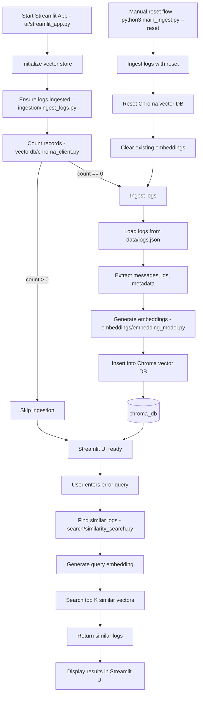

# Vector Log AI POC

This project is a simple AI-powered log search application. It ingests sample application logs, generates embeddings for each log message, stores them in ChromaDB, and provides a Streamlit UI to search for similar failures.

## What the application does

1. Reads sample logs from `data/logs.json`
2. Generates embeddings using the `all-MiniLM-L6-v2` sentence-transformer model
3. Stores embeddings in a persistent Chroma vector database under `chroma_db/`
4. Launches a Streamlit interface for similarity-based log search
5. Returns the closest matching failures with service, severity, and distance

## Project structure

```text
vector-log-ai-poc/
├── config/
├── data/
│   └── logs.json
├── embeddings/
├── ingestion/
├── search/
├── ui/
│   └── streamlit_app.py
├── vectordb/
├── chroma_db/
├── main_ingest.py
├── requirements.txt
└── README.md
```

## Prerequisites

- Python 3.9 or later
- `pip`
- Internet access during first run to download the embedding model from Hugging Face

## Setup

Open a terminal in the project root:

```bash
cd /Users/shonasandy/git_repo/vector-log-ai-poc
```

Create and activate a virtual environment:

```bash
python3 -m venv .venv
source .venv/bin/activate
```

Install dependencies:

```bash
pip install --upgrade pip
pip install -r requirements.txt
```

## Run the application

Start the Streamlit app:

```bash
streamlit run ui/streamlit_app.py
```

After the app opens in the browser:

1. Wait for the vector database to initialize
2. Enter an error message or failure description
3. Click `Search`
4. Review the similar failures returned by the app

## Sample queries

You can try queries like:

- `payment api timeout`
- `invalid number in update account`
- `file not found during transaction load`
- `numeric value error in load customer`

## Data Flow



## Important notes

- The vector database is stored locally in `chroma_db/`
- The current app startup flow re-ingests the logs when the Streamlit app initializes
- The sample input logs are stored in `data/logs.json`
- Search result count is currently controlled by `TOP_K_RESULTS` in `config/settings.py`

## Troubleshooting

If `streamlit` is not found:

```bash
source .venv/bin/activate
```

If dependency installation fails for `torch` or `sentence-transformers`:

- Make sure you are using a supported Python version
- Upgrade `pip` before installing requirements

If the first run takes time:

- This is expected because the sentence-transformer model may need to be downloaded

## Current execution command

Use this command from the project root:

```bash
streamlit run ui/streamlit_app.py
```
