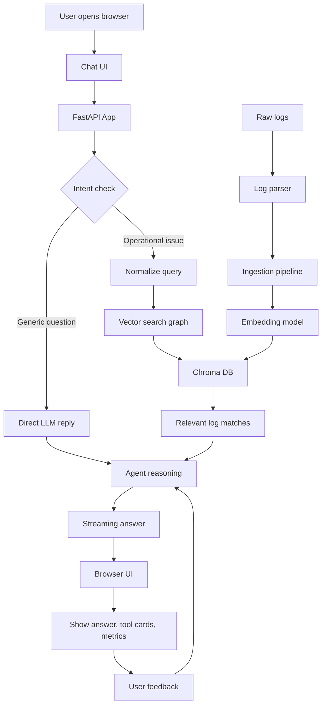
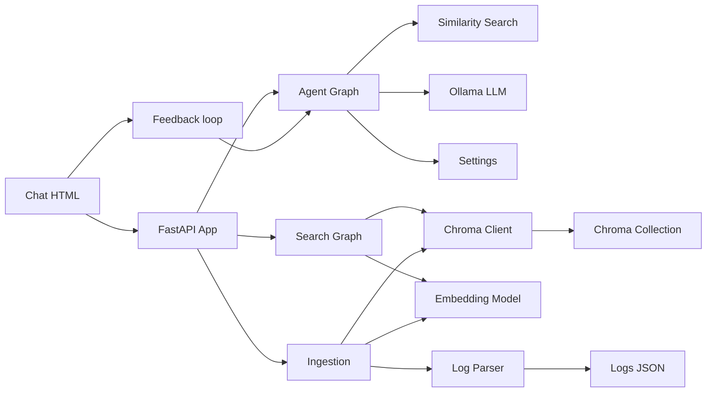
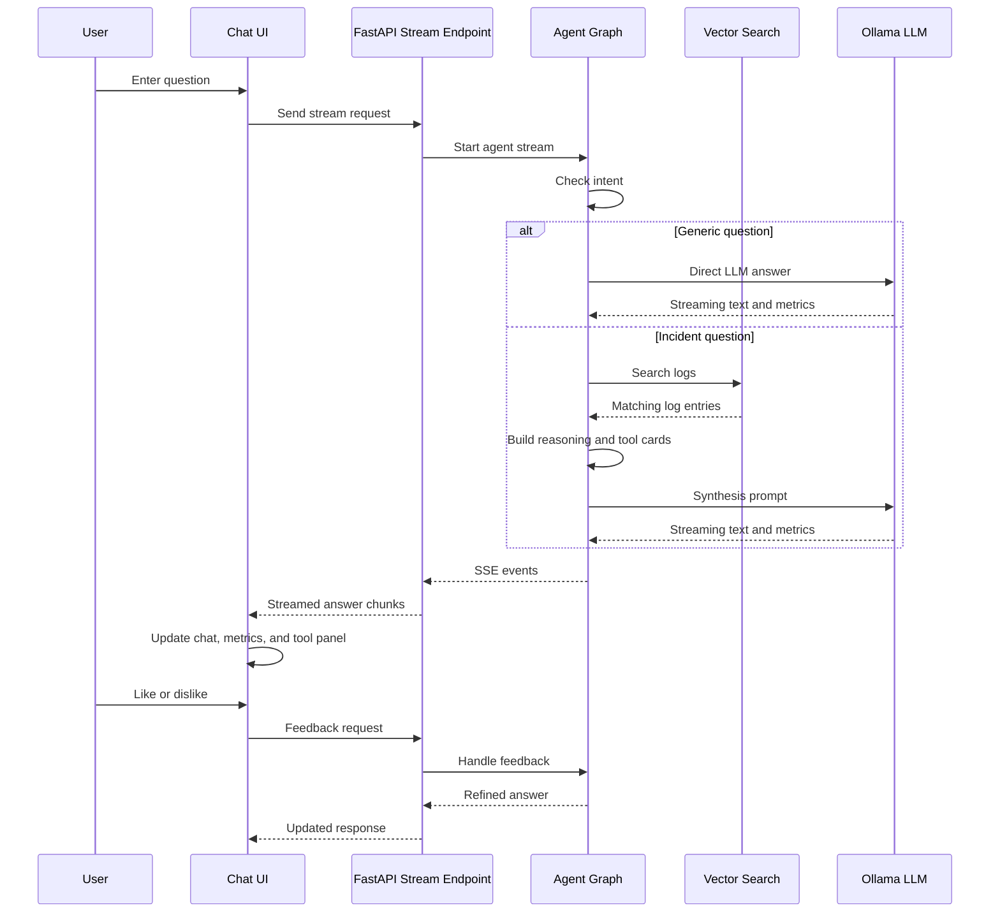
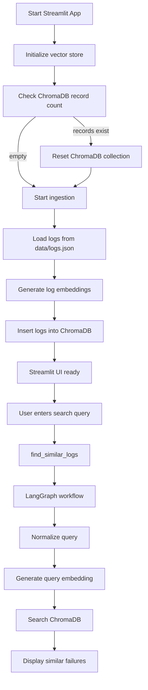

# Vector Log AI POC

This project is a log investigation assistant that combines local vector search, embeddings, and an LLM-backed orchestration flow. The system reads sample application logs, converts them into embeddings, stores them in ChromaDB, and then answers incident-style questions by comparing the user input with historical log entries. A custom FastAPI backend plus a browser chat UI are also included so the project can function as both an API service and an interactive investigation assistant.

## What this project does

1. Loads synthetic application logs from `data/logs.json`
2. Builds semantic embeddings using a sentence-transformer model
3. Stores the embeddings in a local ChromaDB collection under `chroma_db/`
4. Normalizes and compares user queries against historical log events
5. Uses an intent gate to decide whether a question needs RAG or can be answered directly by the LLM
6. Streams a conversational answer to the browser over a FastAPI SSE endpoint
7. Presents tool results, reasoning, follow-up questions, and metrics in a local chat UI

## High-level architecture

At a high level, the application is a retrieval-augmented log analysis system with this flow:

- `data/logs.json` is the raw log dataset
- `utils/log_parser.py` reads the JSON into Python objects
- `ingestion/ingest_logs.py` creates embeddings and writes them into Chroma
- `vectordb/chroma_client.py` wraps the Chroma collection and search API
- `orchestration/log_search_graph.py` turns the retrieval into a LangGraph workflow
- `search/similarity_search.py` normalizes the query before searching
- `orchestration/agent_graph.py` decides whether to use the vector search or go directly to the model
- `api/app.py` exposes the REST endpoints and serves the browser UI
- `api/templates/chat.html` renders the frontend and consumes the streaming responses

### Application flow diagram



### Exact code-module dependency graph



### Streaming request lifecycle



## Project structure

```text
vector-log-ai-poc/
├── api/
│   ├── __init__.py
│   ├── app.py
│   └── templates/
│       └── chat.html
├── config/
│   └── settings.py
├── data/
│   └── logs.json
├── docs/
│   └── 00_Introduction.md
├── embeddings/
│   └── embedding_model.py
├── ingestion/
│   └── ingest_logs.py
├── main_ingest.py
├── orchestration/
│   ├── __init__.py
│   ├── agent_graph.py
│   └── log_search_graph.py
├── search/
│   └── similarity_search.py
├── tests/
│   ├── conftest.py
│   ├── test_agent_api.py
│   ├── test_chroma_client.py
│   ├── test_embedding_model.py
│   ├── test_generate_logs.py
│   ├── test_ingest_logs.py
│   ├── test_log_parser.py
│   ├── test_log_search_graph.py
│   ├── test_similarity_search.py
│   └── test_streamlit_app.py
├── ui/
│   └── streamlit_app.py
├── utils/
│   ├── generate_logs.py
│   └── log_parser.py
├── vectordb/
│   └── chroma_client.py
├── .dockerignore
├── Dockerfile
├── docker-compose.yml
├── requirements.txt
├── README.md
└── chroma_db/
```

## Application flow

### 1. Data ingestion path

This is the initial pipeline for building the knowledge base.

- `utils/generate_logs.py` creates synthetic log records for local testing
- `utils/log_parser.py` reads the JSON log data
- `embeddings/embedding_model.py` turns each log message into an embedding
- `vectordb/chroma_client.py` stores those embeddings in a Chroma collection
- `ingestion/ingest_logs.py` orchestrates the full ingestion job
- `main_ingest.py` is the CLI entry point for re-ingesting the data with optional reset flag

The ingestion flow looks like this:

```text
logs.json -> load_logs() -> embedding_model.generate() -> ChromaVectorDB.insert() -> local vector store
```

### 2. Retrieval flow

Once the vector store is populated, a user query is searched against the stored logs.

- `search/similarity_search.py` normalizes the query text to improve semantic matching
- `orchestration/log_search_graph.py` runs a LangGraph workflow:
  - normalize query
  - generate embedding
  - search the vector DB
- `vectordb/chroma_client.py` returns the closest log matches along with metadata and distances

The retrieval flow looks like this:

```text
user query -> normalize_query() -> embedding generation -> Chroma search -> relevant log documents
```

### 3. Intent-routing and agent flow

The advanced agent layer decides whether to do retrieval or answer directly.

- `orchestration/agent_graph.py` contains the main orchestration logic
- `classify_intent()` decides whether the request is:
  - generic / explanatory and should skip RAG
  - operational / incident-like and should proceed to vector search
- `run_log_agent()` executes the selected route
- `stream_log_agent()` streams partial results to the browser as Server-Sent Events

This is the main decision flow:

```text
user question -> classify_intent()
    -> if generic: direct LLM response, skip RAG
    -> if operational: search_logs -> reasoning -> answer
```

### 4. API flow

The web API is exposed by FastAPI in `api/app.py`.

Endpoints include:

- `GET /api/health`: service healthcheck
- `GET /api/logs/count`: count of ingested records
- `POST /api/search`: direct search endpoint
- `POST /api/ingest`: trigger ingestion manually
- `POST /api/agent/chat`: synchronous chat response
- `POST /api/agent/stream`: streaming event-based answer
- `POST /api/agent/feedback`: user feedback and refinement
- `GET /chat`: serves the custom browser UI

### 5. Front-end flow

The user interface is defined in `api/templates/chat.html`.

The page does the following:

- renders the chat messages in the browser
- sends the user’s message to `/api/agent/stream`
- reads SSE events as the model produces chunks
- updates the answer incrementally without reloading the whole page
- displays tool results, reasoning, execution metrics, and follow-up questions
- persists chat history in browser localStorage
- allows like/dislike feedback to trigger refined follow-up responses

## File-by-file connections

### `config/settings.py`
This stores global settings such as the collection name and default number of retrieval results. Most modules import these constants so the system remains configurable from one place.

### `utils/log_parser.py`
This helper reads `data/logs.json` and returns Python dictionaries for the rest of the app to process.

### `utils/generate_logs.py`
This generates sample log entries used for demo and test data. It creates realistic log messages and writes them into the JSON dataset.

### `embeddings/embedding_model.py`
This wraps the sentence-transformer embedding model and exposes a `generate()` function. It is used during ingestion and during vector query embedding generation.

### `vectordb/chroma_client.py`
This is the database gateway to ChromaDB. It creates the persistent client, manages the collection, inserts documents, and executes similarity queries.

### `ingestion/ingest_logs.py`
This is the ingestion pipeline coordinator. It loads logs, creates embeddings, prepares metadata, and writes everything into ChromaDB.

### `search/similarity_search.py`
This is a helper layer for normalized log search. It cleans and corrects the user query so retrieval is more robust, then delegates to the graph-based search runner.

### `orchestration/log_search_graph.py`
This is the retrieval workflow. It defines a simple state graph:

- normalize query
- generate embedding
- search vector database

It is the lower-level RAG building block used by the higher-level agent.

### `orchestration/agent_graph.py`
This is the orchestration brain of the project. It handles:

- intent classification
- generic direct-answer routing
- retrieval execution
- LLM response generation
- stream event generation
- follow-up question generation
- feedback handling and refined answers

### `api/app.py`
This is the FastAPI application entry point. It wires the agent and retrieval functions to web routes and exposes the browser UI.

### `api/templates/chat.html`
This is the browser-based frontend. It handles streaming response rendering, tool cards, metrics, follow-ups, and user feedback actions.

### `ui/streamlit_app.py`
This is the legacy Streamlit prototype. It shows a simple search UI for directly querying the vector DB without the FastAPI agent layer.

### `main_ingest.py`
This script is the command-line entry point to re-ingest logs. It can optionally wipe the database before reindexing.

## Local setup

### Prerequisites

- Python 3.12 recommended
- pip
- local access to Ollama if you are using the local LLM integration
- optional Docker for containerized execution

### Create a virtual environment

```bash
cd /Users/shonasandy/git_repo/vector-log-ai-poc
python3 -m venv .venv
source .venv/bin/activate
```

### Install dependencies

```bash
pip install --upgrade pip
pip install -r requirements.txt
```

## Run the ingestion pipeline

You can ingest logs manually with:

```bash
python main_ingest.py --reset
```

This resets the Chroma collection and re-populates it with the data in `data/logs.json`.

## Run the Streamlit prototype

```bash
streamlit run ui/streamlit_app.py
```

This is useful for a quick direct-search prototype. It does not include the more advanced FastAPI and LangGraph agent flow.

## Run the FastAPI backend

```bash
source .venv/bin/activate
uvicorn api.app:app --host 0.0.0.0 --port 8000 --reload
```

Then open:

```text
http://localhost:8000/chat
```

## Optional: run with Docker

```bash
docker compose up --build
```

This starts the service and exposes the app on port 8000 or the configured port from Compose.

## Typical request flow in action

When a user asks a question like: “database connection timeout in payment-service”, the system behaves like this:

1. `api.app` receives the HTTP request
2. `run_log_agent()` runs in `orchestration/agent_graph.py`
3. `classify_intent()` checks whether the prompt is generic or investigation-oriented
4. Since the request is operational, the agent calls the search tool
5. `search_logs_tool()` routes to the normalization and vector search layer
6. ChromaDB returns matching logs and metadata
7. The agent builds a reasoning summary and follow-up suggestions
8. The LLM generates a conversational answer
9. `stream_log_agent()` emits SSE events to the browser
10. `api/templates/chat.html` renders the answer, tool cards, and metrics in the UI

## Development notes

- The project is designed as a local, self-contained log intelligence prototype.
- It does not require a cloud-hosted model to operate; Ollama can be used locally for the LLM layer.
- The Chroma database persists locally under `chroma_db/`, so repeated runs reuse prior embeddings unless you reset the collection.
- The code intentionally separates retrieval from orchestration so different LLM or search strategies can be swapped in later.

## Key takeaways

This project demonstrates a practical pattern for AI-assisted log investigation:

- structured log data as vector search documents
- retrieval to find similar historical incidents
- an orchestration layer to decide when to use retrieval
- a conversational LLM response layer for plain-English explanations
- a user-facing interface for operational triage and incident analysis

- `EMBEDDING_MODEL`
- `VECTOR_COLLECTION`
- `TOP_K_RESULTS`

### 12. Run Commands Inside The Container

Open a shell in a one-off container:

```bash
docker compose run --rm vector-log-ai-poc bash
```

Run tests inside Docker:

```bash
docker compose run --rm vector-log-ai-poc pytest
```

Run manual ingestion inside Docker:

```bash
docker compose run --rm vector-log-ai-poc python3 main_ingest.py --reset
```

Verify dependencies inside Docker:

```bash
docker compose run --rm vector-log-ai-poc python -c "import streamlit, chromadb, sentence_transformers, torch, langgraph; print('docker dependencies ok')"
```

### 13. Clean Up Docker Resources

Stop and remove the container network:

```bash
docker compose down
```

Stop and remove containers plus the Hugging Face cache volume:

```bash
docker compose down -v
```

Remove the built image:

```bash
docker image rm vector-log-ai-poc-vector-log-ai-poc
```

Remove local ChromaDB files from the repo only if you want to reset the vector database:

```bash
rm -rf chroma_db
mkdir chroma_db
```

### 14. Common Docker Troubleshooting

If Docker cannot find dependencies, rebuild the image:

```bash
docker compose build --no-cache
docker compose up
```

If the build fails while compiling `chroma-hnswlib`, confirm the `Dockerfile` installs `build-essential`.

If port `8501` is already in use, either stop the other process or change the host port in `docker-compose.yml`.

If the app is slow on the first run, wait for the Hugging Face embedding model to download. Later runs should be faster because the model cache is stored in the `huggingface_cache` Docker volume.

## Optional: Ingest Logs Manually

You can load the sample logs without starting Streamlit:

```bash
python3 main_ingest.py
```

To clear the existing ChromaDB collection first:

```bash
python3 main_ingest.py --reset
```

## Run Tests

Run the full test suite:

```bash
pytest
```

Expected result:

```text
24 passed
```

## Sample Queries

Try searches like:

- `payment api timeout`
- `invalid number in update account`
- `file not found during transaction load`
- `numeric value error in load customer`

## LangGraph Workflow

Search requests are orchestrated in `orchestration/log_search_graph.py`.

The graph runs these nodes:

1. `normalize_query`: cleans the user query and corrects close typos
2. `generate_embedding`: creates an embedding for the normalized query
3. `search_vector_db`: searches ChromaDB for similar log messages

The Streamlit UI still calls `find_similar_logs()` from `search/similarity_search.py`, and that function delegates to the LangGraph workflow.

## Data Flow



## Configuration

Core settings are in `config/settings.py`:

- `EMBEDDING_MODEL`: sentence-transformer model name
- `VECTOR_COLLECTION`: ChromaDB collection name
- `TOP_K_RESULTS`: number of search results requested from ChromaDB

## Troubleshooting

If `streamlit` is not found, activate the virtual environment:

```bash
source .venv/bin/activate
```

If dependency installation fails:

```bash
pip install --upgrade pip
pip install -r requirements.txt
```

If Streamlit shows `ModuleNotFoundError: No module named 'langgraph'`, install the project dependencies into the same virtual environment used to launch Streamlit:

```bash
source .venv/bin/activate
python -m pip install -r requirements.txt
streamlit run ui/streamlit_app.py
```

If the first search or startup is slow, that is usually the embedding model downloading for the first time.
